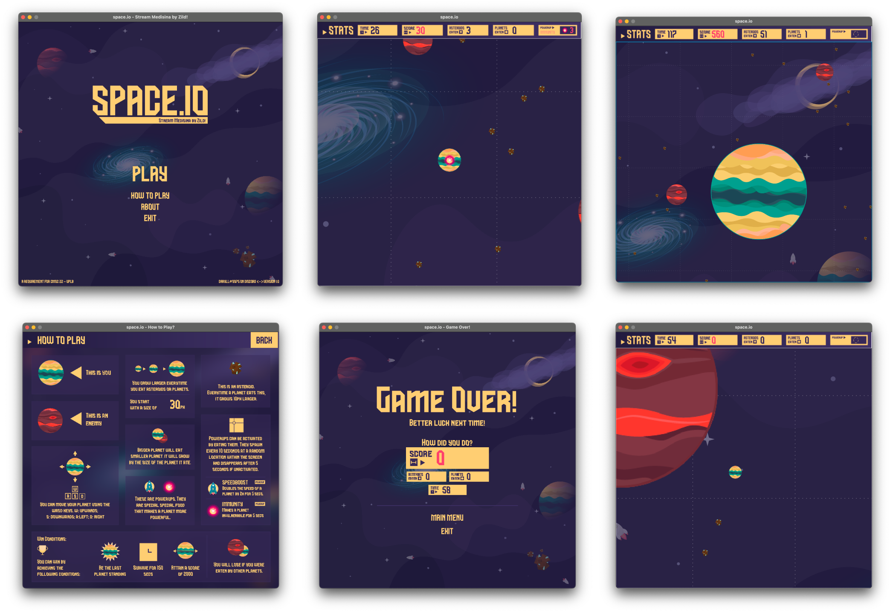

  
  <h1>space.io</h1>
  
An agar.io clone made using JavaFX.

<h2>
  Screenshots
</h2>

    

## How to Run
- This game requires at least `Java 17`.
- This instructions will be tailored to IntelliJ IDEA IDE.
- Since `JavaFX` bundle is no longer included in the latest versions of Java, it must be manually imported to the project. Do the following steps:
  1. Download the JavaFX library [here](https://gluonhq.com/products/javafx/).
  2. Extract the downloaded compressed file.
  3. Take note of the location of the extracted files.
- To run the game:
  1. Configure the `Java SDK` on `File > Project Structure > Project Settings > Project > SDK` with at least a `Java 17` JDK.
  2. While still on project structure, go to `Libraries` tab and press the add button.
  3. Locate the `lib` folder from the extracted JavaFX library earlier and import the folder.
  4. Go to `Modules` tab and go to `Dependencies`.
  5. Press the add button and select `JAR/Directories` and locate the `lib` folder from the extracted JavaFX library.
  6. Go to `Main.java` which can be found on `./src/spaceIO`.
